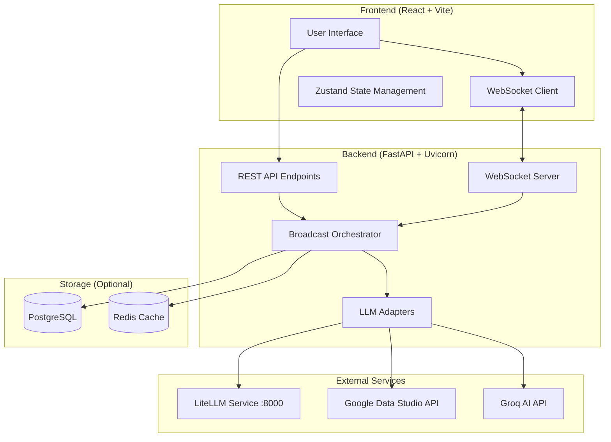

# Design Document

## Overview

The Multi-LLM Broadcast Workspace is architected as a modern web application with a React frontend and FastAPI backend, designed for real-time streaming communication between multiple LLM providers. The system emphasizes performance, scalability, and user experience through WebSocket-based streaming, modular provider adapters, and responsive UI components.

## Architecture

### High-Level Architecture



### System Components

#### Frontend Layer
- **React 18 + TypeScript 5**: Modern component-based UI with type safety
- **Vite 5**: Fast development and optimized production builds
- **Zustand**: Lightweight state management for session and pane data
- **WebSocket Client**: Real-time communication for streaming responses
- **Window Management Library**: External library for browser tab panel management (reduces custom layout complexity)

#### Backend Layer
- **FastAPI + Uvicorn**: High-performance async API server
- **WebSocket Server**: Real-time bidirectional communication
- **Broadcast Orchestrator**: Coordinates multi-provider requests
- **LLM Adapters**: Integration layer supporting LiteLLM service, Google Data Studio, and Groq AI

#### LLM Integration Strategy
- **Primary**: LiteLLM service running on Docker (port 8000) handles model management and provider abstraction
- **Direct APIs**: Google Data Studio and Groq AI for specialized functionality
- **Benefits**: Simplified provider management, unified streaming interface, reduced complexity

#### Window Management Strategy
- **External Library**: Leverages existing browser tab panel management solution
- **Reduced Development**: Eliminates need for custom layout, resize, drag-and-drop logic
- **Features**: Built-in support for resizable panes, tab management, window persistence
- **Integration**: Library handles UI layout while we focus on chat functionality and LLM integration

## Components and Interfaces

### Frontend Components

#### Core UI Components

**BroadcastBar**
```typescript
interface BroadcastBarProps {
  onBroadcast: (prompt: string, models: ModelSelection[]) => void;
  availableModels: ModelInfo[];
  isStreaming: boolean;
}

interface ModelSelection {
  providerId: string;
  modelId: string;
  temperature?: number;
  maxTokens?: number;
}
```

**PaneGrid (using external window management library)**
```typescript
interface PaneGridProps {
  panes: ChatPane[];
  windowManagerConfig: WindowManagerConfig;
  onPaneAction: (action: PaneAction) => void;
}

interface ChatPane {
  id: string;
  modelInfo: ModelInfo;
  messages: Message[];
  isStreaming: boolean;
  metrics: PaneMetrics;
}

interface WindowManagerConfig {
  layout: 'grid' | 'tabs' | 'split';
  resizable: boolean;
  closable: boolean;
  draggable: boolean;
}
```

**CompareBar**
```typescript
interface CompareBarProps {
  availablePanes: ChatPane[];
  selectedPanes: [string, string] | null;
  onCompareToggle: (paneIds: [string, string] | null) => void;
  isComparing: boolean;
}
```

**SendToMenu**
```typescript
interface SendToMenuProps {
  sourcePane: string;
  selectedContent: SelectedContent;
  availableTargets: ChatPane[];
  onSendTo: (targetPaneId: string, content: TransferContent) => void;
}

interface TransferContent {
  messages: Message[];
  provenance: ProvenanceInfo;
}
```

**Meters Panel**
```typescript
interface MetersProps {
  sessionMetrics: SessionMetrics;
  paneMetrics: Record<string, PaneMetrics>;
  costLimits: CostLimits;
}

interface SessionMetrics {
  totalTokens: number;
  totalCost: number;
  averageLatency: number;
  activeRequests: number;
}
```

#### State Management

**Zustand Store Structure**
```typescript
interface AppState {
  // Session Management
  currentSession: Session | null;
  sessions: Session[];
  
  // Pane Management (delegated to window management library)
  activePanes: Record<string, ChatPane>;
  windowManagerState: WindowManagerState;
  
  // UI State
  isComparing: boolean;
  selectedPanes: [string, string] | null;
  metricsVisible: boolean;
  
  // History & Templates
  conversationHistory: ConversationHistory[];
  pipelineTemplates: PipelineTemplate[];
  
  // Actions
  createSession: () => void;
  addPane: (modelInfo: ModelInfo) => void;
  updatePaneMessages: (paneId: string, message: Message) => void;
  transferContent: (sourceId: string, targetId: string, content: TransferContent) => void;
}
```

### Backend Components

#### API Endpoints

**REST API Interface**
```python
# Health Check
@app.get("/health")
async def health_check() -> HealthResponse

# Broadcast Management
@app.post("/broadcast")
async def create_broadcast(request: BroadcastRequest) -> BroadcastResponse

# Content Transfer
@app.post("/send-to")
async def send_to_pane(request: SendToRequest) -> SendToResponse

# Summarization
@app.post("/summarize")
async def generate_summary(request: SummaryRequest) -> SummaryResponse

# History Management
@app.get("/sessions/{session_id}/history")
async def get_session_history(session_id: str) -> HistoryResponse

# Pipeline Templates
@app.post("/templates")
async def create_pipeline_template(request: TemplateRequest) -> TemplateResponse
```

**WebSocket Interface**
```python
@app.websocket("/ws/{session_id}")
async def websocket_endpoint(websocket: WebSocket, session_id: str):
    # Handle real-time streaming events
    # Event types: token, final, meter, error, status
```

#### LLM Adapter Interface

**Base Adapter**
```python
from abc import ABC, abstractmethod
from typing import AsyncGenerator

class LLMAdapter(ABC):
    @abstractmethod
    async def stream(
        self, 
        messages: List[Message], 
        model: str, 
        **kwargs
    ) -> AsyncGenerator[StreamEvent, None]:
        """Stream responses with normalized events"""
        pass
    
    @abstractmethod
    async def get_models(self) -> List[ModelInfo]:
        """Get available models for this provider"""
        pass

class StreamEvent:
    type: Literal["token", "final", "meter", "error"]
    pane_id: str
    data: Union[TokenData, FinalData, MeterData, ErrorData]
    timestamp: datetime
```

**Provider Implementations**
```python
class LiteLLMAdapter(LLMAdapter):
    def __init__(self, base_url: str = "http://localhost:8000"):
        self.base_url = base_url
        self.client = httpx.AsyncClient()
    
    async def stream(self, messages, model, **kwargs):
        # Stream through LiteLLM service which handles multiple providers
        # LiteLLM normalizes responses from different providers
        
class GoogleDataStudioAdapter(LLMAdapter):
    async def stream(self, messages, model, **kwargs):
        # Direct integration with Google Data Studio API
        
class GroqAdapter(LLMAdapter):
    async def stream(self, messages, model, **kwargs):
        # Direct integration with Groq AI API
```

## Data Models

### Core Data Structures

**Message Model**
```typescript
interface Message {
  id: string;
  role: 'user' | 'assistant' | 'system';
  content: string;
  timestamp: Date;
  provenance?: ProvenanceInfo;
  metadata?: MessageMetadata;
}

interface ProvenanceInfo {
  sourceModel: string;
  sourcePaneId: string;
  transferTimestamp: Date;
  contentHash: string;
}
```

**Session Model**
```typescript
interface Session {
  id: string;
  name?: string;
  createdAt: Date;
  updatedAt: Date;
  panes: ChatPane[];
  totalCost: number;
  status: 'active' | 'completed' | 'archived';
}
```

**Pipeline Template Model**
```typescript
interface PipelineTemplate {
  id: string;
  name: string;
  description?: string;
  steps: PipelineStep[];
  modelConfigurations: ModelConfiguration[];
  createdAt: Date;
  usageCount: number;
}

interface PipelineStep {
  order: number;
  prompt: string;
  targetModels: string[];
  dependencies?: string[]; // Previous step IDs
}
```

### Database Schema (Optional PostgreSQL)

```sql
-- Sessions table
CREATE TABLE sessions (
    id UUID PRIMARY KEY DEFAULT gen_random_uuid(),
    name VARCHAR(255),
    created_at TIMESTAMP DEFAULT NOW(),
    updated_at TIMESTAMP DEFAULT NOW(),
    total_cost DECIMAL(10,4) DEFAULT 0,
    status VARCHAR(20) DEFAULT 'active'
);

-- Messages table
CREATE TABLE messages (
    id UUID PRIMARY KEY DEFAULT gen_random_uuid(),
    session_id UUID REFERENCES sessions(id),
    pane_id VARCHAR(255),
    role VARCHAR(20),
    content TEXT,
    model_id VARCHAR(255),
    timestamp TIMESTAMP DEFAULT NOW(),
    provenance JSONB,
    metadata JSONB
);

-- Pipeline templates table
CREATE TABLE pipeline_templates (
    id UUID PRIMARY KEY DEFAULT gen_random_uuid(),
    name VARCHAR(255) NOT NULL,
    description TEXT,
    steps JSONB NOT NULL,
    model_configurations JSONB NOT NULL,
    created_at TIMESTAMP DEFAULT NOW(),
    usage_count INTEGER DEFAULT 0
);

-- Metrics table
CREATE TABLE metrics (
    id UUID PRIMARY KEY DEFAULT gen_random_uuid(),
    session_id UUID REFERENCES sessions(id),
    pane_id VARCHAR(255),
    model_id VARCHAR(255),
    tokens_used INTEGER,
    cost_usd DECIMAL(10,6),
    latency_ms INTEGER,
    timestamp TIMESTAMP DEFAULT NOW()
);
```

## Error Handling

### Error Classification

**Provider Errors**
- Rate limiting (429): Exponential backoff with jitter
- Authentication (401/403): Clear error message, check API keys
- Timeout: Configurable timeout with graceful degradation
- Service unavailable (5xx): Retry with circuit breaker pattern

**Application Errors**
- WebSocket disconnection: Automatic reconnection with exponential backoff
- Session limits exceeded: Clear warning with cost breakdown
- Invalid model selection: Validation with helpful suggestions
- Content transfer failures: Rollback with user notification

### Error Recovery Strategies

```python
class ErrorHandler:
    async def handle_provider_error(
        self, 
        error: ProviderError, 
        pane_id: str
    ) -> ErrorResponse:
        if error.status_code == 429:
            await self.apply_backoff(error.provider)
            return ErrorResponse(
                type="rate_limit",
                message="Rate limit exceeded, retrying...",
                retry_after=error.retry_after
            )
        
        elif error.status_code >= 500:
            return ErrorResponse(
                type="service_error",
                message="Provider temporarily unavailable",
                fallback_available=True
            )
```

## Testing Strategy

### Frontend Testing

**Unit Tests**
- Component rendering and props handling
- State management actions and reducers
- WebSocket client connection handling
- Utility functions and data transformations

**Integration Tests**
- Component interaction workflows
- WebSocket message handling
- State synchronization across components
- Error boundary behavior

**E2E Tests**
- Complete broadcast workflow
- Content transfer between panes
- Compare functionality
- Pipeline template creation and execution

### Backend Testing

**Unit Tests**
- LLM adapter implementations
- API endpoint handlers
- WebSocket event processing
- Error handling logic

**Integration Tests**
- Provider API integration
- Database operations
- WebSocket communication
- Concurrent request handling

**Load Tests**
- Multiple concurrent broadcasts
- WebSocket connection limits
- Provider rate limit handling
- Memory usage under load

### Test Implementation

```python
# Example backend test
@pytest.mark.asyncio
async def test_broadcast_orchestrator():
    orchestrator = BroadcastOrchestrator()
    request = BroadcastRequest(
        prompt="Test prompt",
        models=["openai:gpt-4", "anthropic:claude-3"],
        session_id="test-session"
    )
    
    responses = []
    async for event in orchestrator.broadcast(request):
        responses.append(event)
    
    assert len(responses) >= 2  # At least one response per model
    assert all(event.type in ["token", "final", "meter"] for event in responses)
```

```typescript
// Example frontend test
describe('BroadcastBar', () => {
  it('should trigger broadcast with selected models', () => {
    const mockOnBroadcast = jest.fn();
    render(
      <BroadcastBar 
        onBroadcast={mockOnBroadcast}
        availableModels={mockModels}
        isStreaming={false}
      />
    );
    
    fireEvent.change(screen.getByRole('textbox'), {
      target: { value: 'Test prompt' }
    });
    fireEvent.click(screen.getByText('Broadcast'));
    
    expect(mockOnBroadcast).toHaveBeenCalledWith(
      'Test prompt',
      expect.arrayContaining([
        expect.objectContaining({ modelId: expect.any(String) })
      ])
    );
  });
});
```

This design provides a solid foundation for building the Multi-LLM Broadcast Workspace with clear separation of concerns, scalable architecture, and comprehensive error handling.